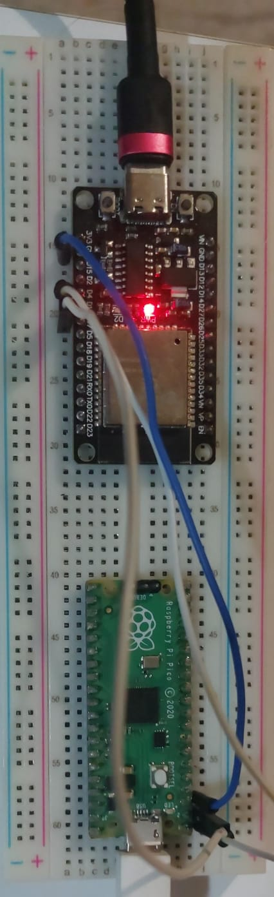
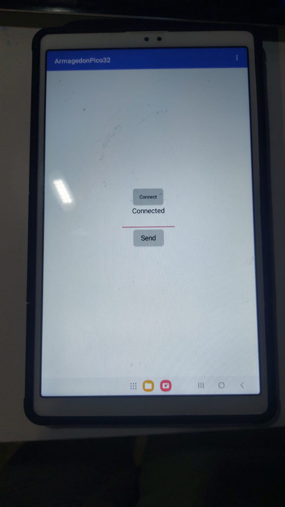

# ArmagedonPico32
A bluetooth controled HID device.
## This project is intended for educational and learning purposes only. It is not designed, tested, or intended for use in production, commercial, or real-world environments. The authors assume no responsibility for any misuse of this material.

## Conections
| Pico    | ESP32   |
| ------- | ------- |
| GND     | GND     |
| UART TX | UART RX |
| UART RX | UART TX |

Example pins:

- Pico: GP0 (TX) / GP1 (RX)
- ESP32: GPIO16 (RX) / GPIO17 (TX) (common default)

## Setup

### The esp32
- Install [ArduinoIDE](https://www.arduino.cc/en/software/)
- Follow this [guide](https://randomnerdtutorials.com/installing-the-esp32-board-in-arduino-ide-windows-instructions/) to add ESP32 support
- Open the **esp32send.ino** file in the **esp32send** folder.
- Plug in your esp32 (preferably in the own pc's usb port)
- Select so the board is on the new COM, not COM1 and select so it's a **ESP32 Dev Module**
- Flash it

### The pico
- Connect the Raspberry Pi Pico to your computer while holding down the BOOTSEL button. When it appears as a removable storage device, release the BOOTSEL button.
- Open the **picorecivet** folder from the files provided. Copy the flash_nuke.uf2 file to the Raspberry Pi Pico. Wait until it restarts. This process clears the existing firmware.
- Open the **picorecive** folder, Copy the **adafruit-circuitpython-raspberry_pi_pico-en_US-9.1.1.uf2** file to your Raspberry Pi Pico. Wait until it restarts. After restarting, the Pico should appear as a drive named CIRCUITPY.
- Copy the **adafruit_hid** folder in the lib folder on CIRCUITPY drive, click replace if it asks.
- Copy the **code.py**, click replace if it asks.

### Usage
Download the app, install it and conect the esp to the bluetooth with the name **ArmagedonPico32**.
You can now run HID payloads from the app.

### App
This is the app
 
